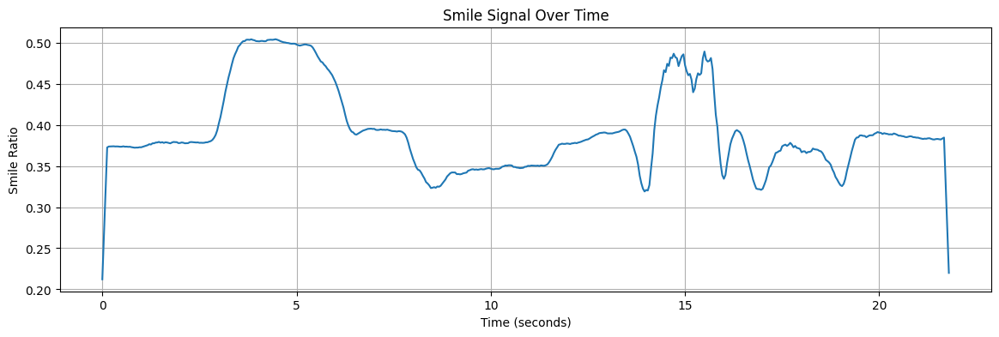
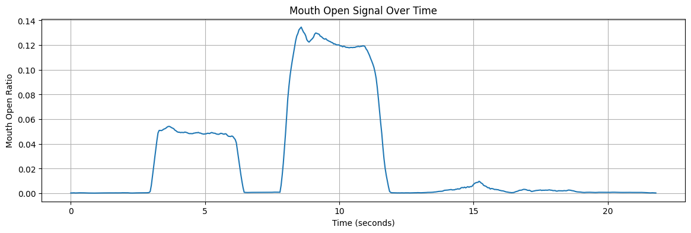
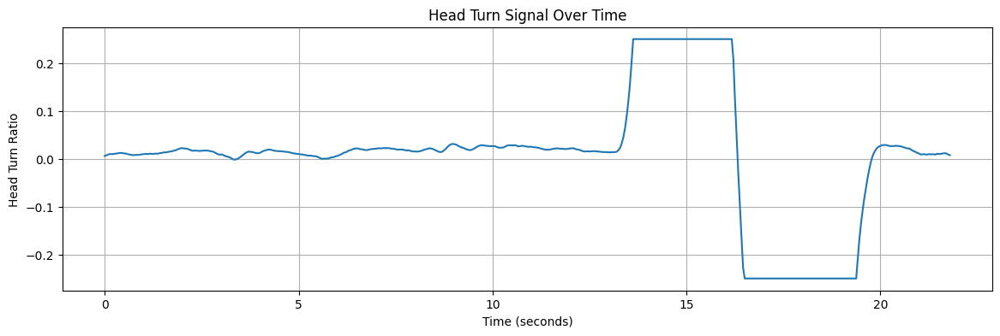

# Facial Behavior Event Detector using **OpenCV and MediaPipe**
This project detects simple facial behavior events from video using OpenCV and MediaPipe Face Mesh. It extracts facial landmarks frame by frame, computes interpretable behavioral signals, and generates an annotated output video.

## Features
- Smile detection
- Mouth-open detection
- Head-turn detection
- Time-series signal extraction
- Frame-level event labeling
- Annotated preview video with measurements

## Tech Stack
- Python
- OpenCV
- MediaPipe
- NumPy
- Matplotlib
- Google Colab

## Signals Extracted
- Smile Ratio
- Mouth Open Ratio
- Head Turn Ratio

## Outputs

### Annotated Preview Video
[View Video](outputs/annotated_preview_with_measurements.mp4)

### Annotated Frame Example

### Signal Plots
  
  

### Extracted signals in CSV format

## Project Structure
- `facial_behavior_event_detector.ipynb` — main notebook
- `signals.csv` — extracted facial behavior signals
- `outputs/` — annotated video and screenshot
- `plots/` — signal visualizations

## Why
This project is a first-stage behavioral signal extraction for human behavior analysis. The extracted time-series features can later be used for temporal modeling and classification tasks.

## Notes
The raw input video is not included in this repository due to file size constraints.
